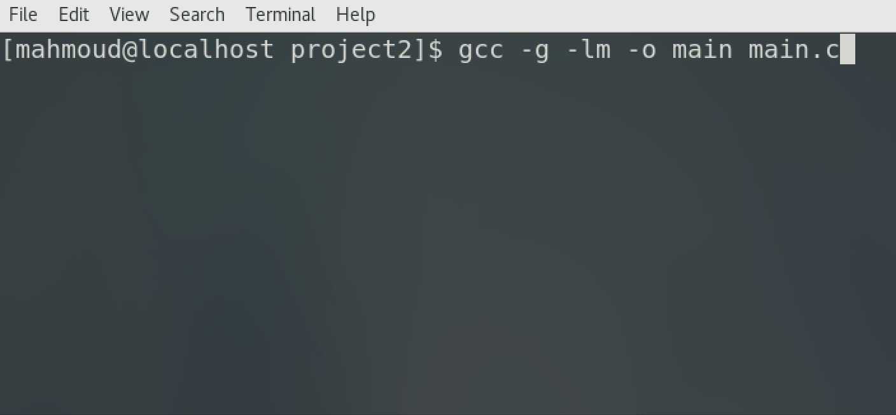

# Word Count Using Multiple Processes

CONTENTS OF THIS FILE
---------------------
 * Introduction
 * Installation

INTRODUCTION
------------
This is a simple C program that uses multiple processes and pipes to read a file and count the number of words in that files. An illustration of the output is shown below:




Installation
------------
```sh
$ make
$ ./main <input_file.txt>
```


